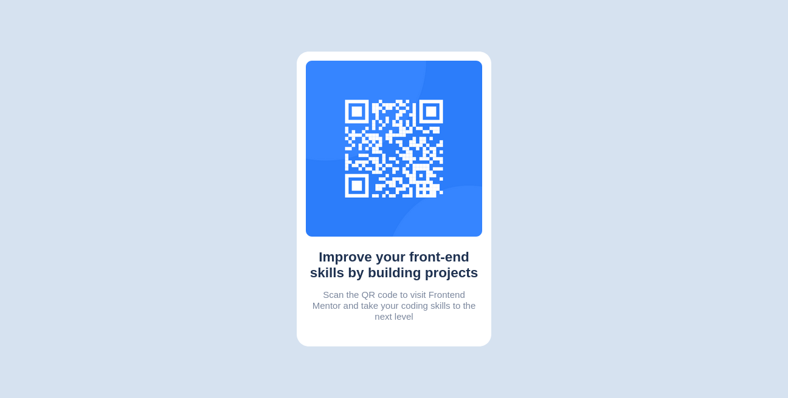

# Frontend Mentor - QR code component solution

This is a solution to the [QR code component challenge on Frontend Mentor](https://www.frontendmentor.io/challenges/qr-code-component-iux_sIO_H). Frontend Mentor challenges help you improve your coding skills by building realistic projects. 

## Table of contents

- [Overview](#overview)
  - [Screenshot](#screenshot)
  - [Links](#links)
- [My process](#my-process)
  - [Built with](#built-with)
  - [What I learned](#what-i-learned)
  - [Useful resources](#useful-resources)
- [Author](#author)

## Overview

### Screenshot



### Links

- Solution URL: [Add solution URL here](https://your-solution-url.com)
- Live Site URL: [Add live site URL here](https://your-live-site-url.com)

## My process

### Built with

- Semantic HTML5 markup
- CSS custom properties
- Flexbox
- Mobile-first workflow

### What I learned

i learn new thing in css styling specialy adding font from google external & internal
```html
<link rel=stylesheet href="">
```
```css
@import url("");
```

i also learn how important is etimating my work time how long it need to take the project done fully or each sub work

### Useful resources

- [Font]((https://fonts.google.com/specimen/Outfit)) - This font make your web dsign more tidy and compact really fit for most web design

## Author
- Website - [arijordi](https://arijordi.github.io)
- Frontend Mentor - [arijordi](https://www.frontendmentor.io/profile/yourusername)

